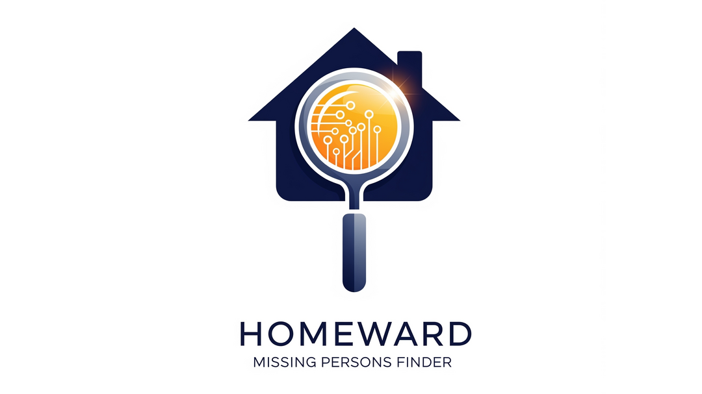
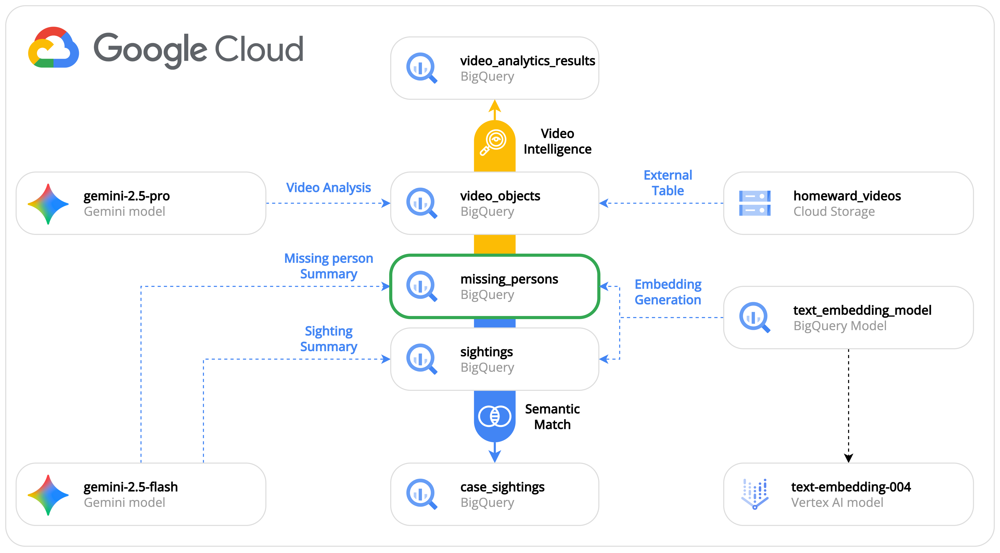

# Homeward: AI-Powered missing persons finder

**🥽 This repo contains my submission for the [BigQuery AI Hackathon](https://www.kaggle.com/competitions/bigquery-ai-hackathon)**



## Overview

**Homeward** is an innovative missing persons finder application that leverages the power of Google Cloud Platform's AI capabilities to help law enforcement agencies locate missing individuals through video surveillance analysis and semantic matching between case reports and sightings.

The primary goals and objectives of the Homeward application are:

* **Accelerate search operations**: Significantly reduce the time required to find a missing person by automating the analysis of video footage and the matching of case reports and sightings.
* **Improve investigation accuracy**: Leverage AI to identify potential sightings and connections that might be missed by human operators.
* **Centralize case information**: Provide a single, unified platform for registering missing persons, logging sightings, and managing all related case data.

The primary users of this application are:

* **Law enforcement officers**: Police officers and detectives directly responsible for investigating missing person cases.
* **Government agency personnel**: Staff from national or regional centers for missing persons who are involved in the coordination and management of these cases.

## 🎯 Hackathon Highlights

This submission showcases several innovative features of BigQuery:

1. **Object tables for Video processing**: Utilizing BigQuery's object tables to create external references to video files in Cloud Storage
2. **Multimodal data analysis**: Analyzing video content through Gemini models for person detection and matching with just SQL.
3. **Object table metadata enrichment and filtering**: Using object metadata to filter-out unwanted files (time-filtering and geo-filtering) and let Gemini analyze only the needed files.
4. **Semantic matching**: Leveraging Gemini summarizations, embeddings and vector similarity to match cases with sightings.
5. **Semantic search**: Natural language queries for finding specific missing cases.

## 🏗️ Architecture


### Technology Stack

- **Frontend/Backend**: Python with NiceGUI framework
- **Database**: Google BigQuery
- **Object Storage**: Google Cloud Storage
- **AI/ML**: Google Gemini multimodal models and Vertex AI embedding models

### Data Flow - Case registration

### Data Flow - Sighting registration

### Data Flow - Video intelligence

1. **Video ingestion**: Videos are uploaded to Google Cloud Storage with the following naming convention: `CameraID_YYYYMMDDHHMMSS_LATITUDE_LONGITUDE_CAMERATYPE_RESOLUTION.mp4`
2. **Metadata reference**: BigQuery object tables reference processed videos
4. **AI Analysis**: Gemini models analyze video content based on missing person descriptions
5. **Result Management**: Interactive dashboard for case and sighting management

### Data Flow - Semantic Matching

### Data Flow - Semantic Search

## 🚀 Quick Start

### Prerequisites

- Google Cloud Platform account with billing enabled
- `gcloud` CLI installed and authenticated
- Python 3.8+ with `uv` package manager
- Access to the following GCP APIs:
  - BigQuery API
  - Cloud Storage API
  - Vertex AI API
  - Geocoding API

### Project setup
This repository includes two versions of the same use case:
- A jupyter notebook with a light version of the use case (same functionalities and BQ queries)
- A web application with a UI interface to interact with BigQuery (suggested if you want to see all the capabilities of the solution)

Depending of the version you want to try, you can follow the following instructions for the setup:

#### Project Setup - 📊 Notebook

Open the `demo-notebook.ipynb` file with your preferred Jupyter notebook editor or run the following command:

```bash
jupyter notebook demo-notebook.ipynb
```

The notebook contains the code for:
- Setting up BigQuery object tables for video files
- Creating Gemini model connections
- Running multimodal AI queries on video content
- Processing results and extracting insights

#### Project Setup - Web Application

1. **Clone the repository:**
   ```bash
   git clone <repository-url>
   cd missing-finder
   ```

2. **Run the setup script:**
   ```bash
   ./setup.sh --project-id your-project-id --region us-central1
   ```

   **Optional: Include demo data**
   ```bash
   ./setup.sh --project-id your-project-id --region us-central1 --demo-folder ./demo
   ```

   The setup script will:
   - Create necessary GCP resources (storage buckets, BigQuery datasets, connections)
   - Configure IAM permissions
   - Set up Gemini AI model endpoints
   - Populate demo data if specified

3. **Configure environment variables:**
   ```bash
   cp .env.example .env
   # Edit .env with your specific configuration
   ```

4. **Run the application:**
   ```bash
   uv run --env-file=.env python src/homeward/main.py
   ```

   The application will be available at `http://localhost:8080`

## 🎮 Core Features

### Missing Person Case Management
- **Comprehensive Forms**: Detailed missing person registration with photos and metadata
- **Case Timeline**: Track all sightings and analysis results
- **CRUD Operations**: Full case management capabilities

### AI-Powered Video Analysis
- **Geographic Filtering**: Select cameras by location and search radius
- **Temporal Filtering**: Analyze videos within specific time ranges
- **Semantic Matching**: Natural language descriptions for person identification
- **Confidence Scoring**: AI-generated confidence levels for potential matches

### Sighting Management
- **Manual Registration**: Allow manual sighting reports from various sources
- **Automatic Linking**: Connect AI-detected sightings to existing cases
- **Timeline Integration**: Visualize sightings on case timelines

### Interactive Dashboard
- **KPI Cards**: Real-time statistics on cases, sightings, and analysis results
- **Interactive Maps**: Visualize camera locations and sighting patterns
- **Result Management**: Review and confirm AI-generated matches

## 📁 Project Structure

```
homeward/
├── src/homeward/           # Main application code
│   ├── ui/                 # NiceGUI user interface components
│   ├── services/           # Business logic and data services
│   ├── models/             # Data models and schemas
│   └── main.py             # Application entry point
├── demo/                   # Demo data and examples
│   ├── videos/             # Sample surveillance footage
│   └── reports/            # Sample case and sighting data
├── sql/                    # Database schemas and migrations
├── setup.sh                # Automated GCP setup script
├── demo-notebook.ipynb     # Interactive BigQuery + Gemini demo
├── limitations.ipynb       # Known limitations and workarounds
└── README.md               # This file
```

## 🔧 Configuration

### Environment Variables

The application uses the following environment variables (see `.env.example`):

```bash
# Application Configuration
HOMEWARD_VERSION=0.1.0
HOMEWARD_DATA_SOURCE=bigquery  # or "mock" for development

# BigQuery Configuration
HOMEWARD_BIGQUERY_PROJECT_ID=your-project-id
HOMEWARD_BIGQUERY_DATASET=homeward

# Google Cloud Storage
HOMEWARD_VIDEO_BUCKET=your-video-bucket
HOMEWARD_GCS_BUCKET_INGESTION=your-ingestion-bucket
HOMEWARD_GCS_BUCKET_PROCESSED=your-processed-bucket

# BigQuery AI Configuration
HOMEWARD_BQ_CONNECTION=homeward_gcp_connection
HOMEWARD_BQ_TABLE=video_objects
HOMEWARD_BQ_MODEL=gemini_2_5_pro

# API Keys
HOMEWARD_GEOCODING_API_KEY=your-geocoding-api-key

# Service Account
HOMEWARD_SERVICE_ACCOUNT_KEY_PATH=downloads/key.json
```

### Setup Script Parameters

The `setup.sh` script accepts the following parameters:

- `--project-id`: Google Cloud Project ID (required)
- `--region`: Google Cloud region (required, e.g., `us-central1`)
- `--demo-folder`: Path to demo data folder (optional)

## 🎯 BigQuery AI Integration

### Object Tables

The project leverages BigQuery's object tables to create direct references to video files:

```sql
CREATE EXTERNAL TABLE `project.dataset.video_objects`
OPTIONS (
  object_metadata = 'SIMPLE',
  max_staleness = INTERVAL 1 HOUR,
  metadata_cache_mode = 'AUTOMATIC'
);
```

### Gemini Model Integration

Videos are analyzed using Google's Gemini models through BigQuery:

```sql
SELECT ml_generate_text_llm_result
FROM ML.GENERATE_TEXT(
  MODEL `project.dataset.gemini_model`,
  TABLE `project.dataset.video_objects`,
  STRUCT(
    'Find a person matching this description: tall, wearing red jacket' AS prompt,
    TRUE AS FLATTEN_JSON_OUTPUT
  )
);
```

## ⚠️ Known Limitations

Based on our development experience, we've identified several limitations with the current BigQuery AI integration:

### 1. Manual Cache Refresh Issues
- **Problem**: Manual cache refresh for object tables doesn't work as expected
- **Impact**: May require waiting for automatic cache refresh cycles
- **Workaround**: Use automatic cache refresh with appropriate `max_staleness` settings

### 2. ML.GENERATE_TEXT with Object Tables
- **Problem**: Direct use of `ML.GENERATE_TEXT` with object tables encounters issues with both global and regional endpoints
- **Impact**: Limits direct video analysis capabilities
- **Current Status**: Under investigation, may require alternative approaches

### 3. Object Table as Standard Table Treatment
- **Problem**: Treating object tables as standard tables in `ML.GENERATE_TEXT` queries fails
- **Impact**: Requires specific handling for video content analysis
- **Workaround**: Use object table-specific functions and configurations

For detailed technical information about these limitations, see `limitations.ipynb`.

## 🤝 Contributing

This project was developed as a submission for the BigQuery AI Hackathon. While the core functionality demonstrates the integration possibilities, there are several areas for future enhancement:

1. **Advanced Video Analytics**: Implement more sophisticated video processing algorithms
2. **Real-time Processing**: Add streaming capabilities for live video analysis
3. **Machine Learning Pipeline**: Develop custom ML models for person identification
4. **Mobile Application**: Create companion mobile app for field officers
5. **Integration APIs**: Develop REST APIs for integration with existing law enforcement systems

## 📄 License

This project is developed as a proof-of-concept for the BigQuery AI Hackathon. Please see individual component licenses for third-party dependencies.

## 🙏 Acknowledgments

- **Google Cloud Platform**: For providing the robust AI and data analytics infrastructure
- **BigQuery Team**: For the innovative object tables and ML integration capabilities
- **Gemini AI**: For powerful multimodal analysis capabilities
- **NiceGUI**: For the excellent Python-based UI framework
- **VIRAT Dataset**: For providing sample video data for demonstration purposes

---

**Built with ❤️ for the [BigQuery AI Hackathon](https://www.kaggle.com/competitions/bigquery-ai-hackathon)**

For questions or support, please refer to the technical documentation in the `docs/` directory or raise an issue in the project repository.