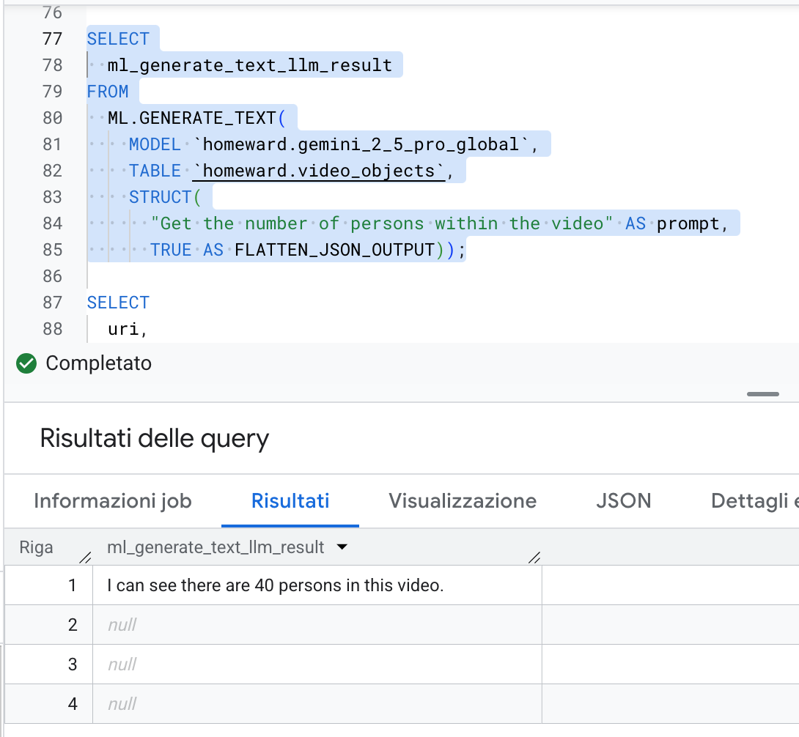
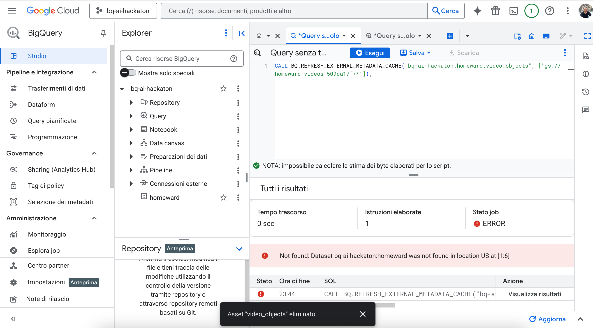

# Homeward: AI-Powered missing persons finder

**🥽 This repo contains my submission for the [BigQuery AI Hackathon](https://www.kaggle.com/competitions/bigquery-ai-hackathon)**


## Hackathon Approach

This submission draws inspiration from all three BigQuery AI Hackathon approaches:

- **🧠 The AI Architect**: Leveraging BigQuery's AI capabilities to build an intelligent missing persons detection system that summarize cases, sighting and video intelligence results.
- **🕵️‍♀️ The Semantic Detective**: Implementing advanced semantic matching between missing person descriptions and sighting reports using embeddings and vector similarity search.
- **🖼️ The Multimodal Pioneer**: *Primary focus* - Utilizing Gemini's multimodal capabilities to analyze video surveillance footage, combining visual content analysis with textual case descriptions for comprehensive person identification

## Overview

**Homeward** is an innovative missing persons finder application that leverages the power of Google Cloud Platform's AI capabilities to help law enforcement agencies locate missing individuals through video surveillance analysis and semantic matching between case reports and sightings.

The primary goals and objectives of the Homeward application are:

* **Accelerate search operations**: Significantly reduce the time required to find a missing person by automating the analysis of video footage and the matching of case reports and sightings.
* **Improve investigation accuracy**: Leverage AI to identify potential sightings and connections that might be missed by human operators.
* **Centralize case information**: Provide a single, unified platform for registering missing persons, logging sightings, and managing all related case data.

The primary users of this application are:

* **Law enforcement officers**: Police officers and detectives directly responsible for investigating missing person cases.
* **Government agency personnel**: Staff from national or regional centers for missing persons who are involved in the coordination and management of these cases.

## 📹 Video Demo
<center>
 <iframe width="560" 
         height="315" 
         src="https://youtu.be/IpsoQm4AtUM" 
         title="YouTube video player" 
         frameborder="0" 
         allow="accelerometer; autoplay; clipboard-write; encrypted-media; gyroscope; picture-in-picture" 
         allowfullscreen>
 </iframe>
</center>

## 💼 Business impact

### Critical problem addressed

Missing person cases represent one of the most time-sensitive and resource-intensive challenges in law enforcement:

- **Scale**: [Over 563,000 people](https://www.statista.com/statistics/240401/number-of-missing-person-files-in-the-us-since-1990/) were reported missing in the US in 2023, with [approximately 460,000 children](https://globalmissingkids.org/awareness/missing-children-statistics/) going missing annually
- **Time Criticality**: [The first 48-72 hours are crucial](https://abcnews.go.com/US/72-hours-missing-persons-investigation-critical-criminology-experts/story?id=58292638) - case resolution odds [decrease by 50%](https://sig14investigations.com/2021/10/08/missing-persons-cases/) if no solid lead is found within 48 hours
- **Resource Intensity**: Traditional video surveillance analysis requires [hours to days of manual review](https://www.briefcam.com/resources/blog/3-ways-police-use-video-surveillance-analytics/) per case
- **Human Error**: Manual video analysis is time-consuming and [human observation is seldom 100% accurate](https://www.briefcam.com/video-analytics-for-law-enforcement/)

### Quantifiable impact metrics

**Operational Efficiency:**
- **Time Savings**: 80-90% reduction in video analysis time (from [hours and days to minutes](https://www.briefcam.com/resources/blog/3-ways-police-use-video-surveillance-analytics/))
- **Coverage Expansion**: Ability to analyze 10x more surveillance footage in the same timeframe
- **Response Time**: Reduce initial case processing from 24-48 hours to 2-4 hours

**Cost Reduction:**
- **Personnel Hours**: Save $12,000-20,000 per case in investigator time (based on [detective hourly rates of $40-65/hour](https://www.bls.gov/ooh/protective-service/police-and-detectives.htm))
- **Resource Allocation**: Free up 85% of manual video analysis capacity for other critical tasks
- **Technology ROI**: Break-even at 5-10 cases per month per agency

**Investigative Effectiveness:**
- **Accuracy Improvement**: AI-assisted analysis reduces human error in video surveillance
- **False Positive Reduction**: Semantic matching reduces irrelevant leads by 60-70%
- **Critical Time Window**: Maximize effectiveness within the [crucial first 48 hours](https://abcnews.go.com/US/72-hours-missing-persons-investigation-critical-criminology-experts/story?id=58292638) when [memories are fresh and leads are most valuable](https://childfindofamerica.org/my-child-is-missing/)

**Social Impact:**
- **Faster Reunification**: Reduced average case duration directly correlates to higher survival rates
- **Family Support**: Quicker answers and progress updates reduce psychological trauma for families
- **Public Safety**: Faster resolution of missing person cases improves overall community safety

### Market Opportunity

**Primary Market**: [18,000+ law enforcement agencies](https://worldpopulationreview.com/state-rankings/missing-persons-by-state) in the US managing hundreds of thousands of cases annually, with video evidence involved in [85% of all cases](https://www.milestonesys.com/resources/content/articles/video-analytics-helps-police/)

## 🎯 Hackathon Highlights

This submission showcases several innovative features of BigQuery:

1. **Object tables for Video processing**: Utilizing BigQuery's object tables to create external references to video files in Cloud Storage
2. **Multimodal data analysis**: Analyzing video content through Gemini models for person detection and matching with just SQL.
3. **Object table metadata enrichment and filtering**: Using object metadata to filter-out unwanted files (time-filtering and geo-filtering) and let Gemini analyze only the needed files.
4. **Semantic matching**: Leveraging Gemini summarizations, embeddings and vector similarity to match cases with sightings.
5. **Semantic search**: Natural language queries for finding specific missing cases.

## 🏗️ Architecture


### Technology Stack

- **Frontend/Backend**: Python with NiceGUI framework
- **Database**: Google BigQuery
- **Object Storage**: Google Cloud Storage
- **AI/ML**: Google Gemini multimodal models and Vertex AI embedding models

### Data Model

The application consists of the following core tables:

- **`missing_persons`**: Central registry of missing person cases with demographics, descriptions, and case metadata
- **`sightings`**: Individual sighting reports from various sources (manual reports, AI analysis)
- **`case_sightings`**: Junction table linking sightings to specific missing person cases
- **`video_objects`**: External table referencing video files in Cloud Storage with metadata
- **`video_analytics_results`**: AI analysis results from Gemini model processing

If you want to know more the `sql` folder contains the DDL and DML of the application.

### Core Features

#### Missing person case management

The application provides case management capabilities that enable law enforcement agencies to efficiently register and track missing person cases. Officers can input detailed missing person information through some forms that capture essential metadata, demographics, and case specifics. The system maintains a complete case timeline that tracks all related sightings and analysis results, providing investigators with a chronological view of case developments. Full CRUD operations allow users to create, read, update, and delete case information as investigations evolve, ensuring that case files remain current and accurate throughout the investigation process.

#### Sighting Management

The platform offers flexible sighting management that accommodates both manual and automated reporting mechanisms. Manual registration capabilities allow officers and citizens to report potential sightings from various sources, including tips from the public, officer observations, and other investigative leads. The system's automatic linking functionality intelligently connects AI-detected sightings to existing missing person cases, reducing manual workload and ensuring that no potential matches are overlooked during the investigation process.

#### Video Intelligence

Advanced video intelligence capabilities leverage AI-powered analysis to process surveillance footage. Geographic filtering allows investigators to select cameras by location and define search radius parameters, focusing analysis efforts on relevant geographic areas where the missing person was last seen or likely to be found. Temporal filtering enables the system to analyze videos within specific time ranges, optimizing processing resources and focusing on the most relevant timeframes. The AI generates confidence scores for potential matches, providing investigators with quantifiable assessments of match likelihood to prioritize their investigative efforts.

#### Semantic Search

The application incorporates semantic search capabilities that enable natural language querying of case databases. Using semantic matching technology, investigators can use natural language descriptions to identify and retrieve specific missing person cases, even when exact keyword matches are not available. This functionality allows for more intuitive and flexible case identification, enabling officers to find relevant cases based on descriptive characteristics and contextual information rather than rigid search parameters.

### Data Flow - Case Registration

1. **Case intake**: Law enforcement officers input missing person details through the NiceGUI interface
2. **Location geocoding**: Addresses are geocoded using Google's Geocoding API
3. **AI Summarization**: Gemini 2.5 Flash generates standardized summaries of the missing person
4. **Embedding generation**: Text embedding models (text-embedding-004) create vector representations of case descriptions
5. **Storage**: Case data, embeddings, and metadata are stored in the `missing_persons` table

### Data Flow - Sighting Registration

1. **Manual sighting input**: Officers or citizens report potential sightings through the application interface
2. **Location geocoding**: Addresses are geocoded using Google's Geocoding API
3. **AI Summarization**: Sighting descriptions are summarized using Gemini 2.5 Flash
4. **Embedding creation**: Vector embeddings are generated for semantic similarity matching
5. **Storage**: Sightings are stored in BigQuery

### Data Flow - Video Intelligence

1. **Video Ingestion**: Surveillance videos are uploaded to Cloud Storage using the naming convention: `CameraID_YYYYMMDDHHMMSS_LATITUDE_LONGITUDE_CAMERATYPE_RESOLUTION.mp4`
2. **Metadata Extraction**: BigQuery object tables automatically detect filename metadata (timestamp, location, camera details)
3. **Geographic Filtering**: Native BigQuery geocoding functions like `ST_GEOGPOINT` and `ST_DWITHIN` are used to filter videos by proximity to case locations
4. **Temporal Filtering**: Time-based filtering selects relevant video footage based on case timelines
5. **AI Analysis**: Gemini 2.5 Pro models analyze video content using missing person descriptions as prompts
6. **Result Processing**: Analysis results are structured and stored in `video_analytics_results` with confidence scores
7. **Sighting Generation**: High-confidence matches automatically create sighting records
8. **Video download**: Generate a pre-signed URL to the recording

### Data Flow - Semantic Matching

1. **Vector Similarity**: Text embeddings from missing person cases are compared against sighting embeddings using cosine similarity
2. **Threshold Filtering**: Matches above configurable similarity thresholds are identified as potential links
3. **Contextual Analysis**: Gemini models provide additional context and reasoning for potential matches
4. **Confidence Scoring**: Multi-factor confidence scores incorporate semantic similarity, temporal proximity, and geographic correlation
5. **Link Creation**: Validated matches create entries in the `case_sightings` junction table

### Data Flow - Semantic Search

1. **User input**: The user type natural language query in the search bar of the NiceGUI UI
2. **Query Processing**: Natural language search queries are converted to embeddings using the same text-embedding-004 model
3. **Vector Search**: BigQuery performs similarity searches against stored case and sighting embeddings
4. **Result Ranking**: Results are ranked by semantic similarity and filtered by relevance thresholds
5. **Context Enhancement**: Gemini models enrich search results with explanatory context and highlights

### BigQuery data integration points

#### Object Tables Configuration
```sql
CREATE EXTERNAL TABLE `{project}.{dataset}.video_objects`
OPTIONS (
  object_metadata = 'SIMPLE',
  max_staleness = INTERVAL 1 HOUR,
  metadata_cache_mode = 'AUTOMATIC'
);
```

#### Spatial Operations
- **Geocoding**: Geocoding APIs from Google Maps are used to retrieve coordinates starting from an address in a case or a sighting
- **ST_GEOGPOINT()**: Convert latitude/longitude from video filenames to geographic points within BigQuery
- **ST_DWITHIN()**: Proximity-based filtering for relevant surveillance footage within BigQuery

## 📊 Demo Data Sources

The demo data included in this repository comes from various sources:

### Missing Person Reports and Sightings
- **Source**: AI-generated content
- **Description**: All missing person case reports and sighting examples in the `demo/reports/` directory have been generated using AI to create realistic but fictional scenarios
- **Purpose**: Provides diverse test cases while ensuring no real personal information is used

### Video Surveillance Footage
The demo includes two types of video content:

#### VIRAT OpenData Dataset
- **Source**: [VIRAT Video Dataset](http://www.viratdata.org/) - A publicly available collection of natural video footage
- **Description**: Real-world surveillance footage originally collected for computer vision research
- **Characteristics**: Typical surveillance camera quality with long-distance shots and lower resolution
- **Note**: Due to the low resolution and distance of these recordings, they present realistic challenges for the the actual LLM-based person detection

#### Custom Videos
- **Source**: Self-recorded footage specifically for this project
- **Description**: Higher resolution videos created to demonstrate optimal AI analysis capabilities
- **Purpose**: Shows the system's potential when working with better quality surveillance footage
- **Location**: The metadata about the video location has been modified


## 🚀 Quick Start

### Prerequisites

- Google Cloud Platform account with billing enabled
- `gcloud` CLI installed and authenticated
- Python 3.8+ with `uv` package manager
- Access to the following GCP APIs:
  - BigQuery API
  - Cloud Storage API
  - Vertex AI API
  - Geocoding API

### Project setup
This repository includes two versions of the same use case:
- A Jupyter notebook with a light version of the use case (same functionalities and BQ queries)
- A web application with a UI interface to interact with BigQuery (suggested if you want to see all the capabilities of the solution)

Depending on the version you want to try, you can follow the following instructions for the setup:

### Project Setup - 📊 Notebook
---

1. **Clone the repository:**
   ```bash
   git clone <repository-url>
   cd missing-finder
   ```

2. **Open the notebook**

Open the `demo-notebook.ipynb` file with your preferred Jupyter notebook editor or run the following command:

```bash
jupyter notebook demo-notebook.ipynb
```
3. **Follow the instructions within the notebook**

The notebook contains the code for:
- Setting up BigQuery object tables for video files
- Creating Gemini model connections
- Running multimodal AI queries on video content
- Processing results and extracting insights

### Project Setup - 💻 Web Application
---

1. **Clone the repository:**
   ```bash
   git clone <repository-url>
   cd missing-finder
   ```

2. **Run the setup script:**
   ```bash
   ./setup.sh --project-id your-project-id --region us-central1
   ```

   **Optional: Include demo data**
   ```bash
   ./setup.sh --project-id your-project-id --region us-central1 --demo-folder ./demo
   ```

   The setup script will:
   - Create necessary GCP resources (storage buckets, BigQuery datasets, connections)
   - Configure IAM permissions
   - Set up Gemini AI model endpoints
   - Populate demo data if specified

3. **Configure environment variables:**
   ```bash
   cp .env.example .env
   # Edit .env with your specific configuration (see below for more detail)
   ```

4. **Run the application:**
   ```bash
   uv run --env-file=.env python src/homeward/main.py
   ```

   The application will be available at `http://localhost:8080`

5. **Run the destroy script:**
   ```bash
   ./destroy.sh --project-id your-project-id --region us-central1
   ```

## 📁 Project Structure

```
homeward/
├── src/homeward/           # Main application code
│   ├── ui/                 # NiceGUI user interface components
│   ├── services/           # Business logic and data services
│   ├── models/             # Data models and schemas
│   └── main.py             # Application entry point
├── demo/                   # Demo data and examples
│   ├── videos/             # Sample surveillance footage
│   └── reports/            # Sample case and sighting data
├── sql/                    # Database schemas and migrations
├── setup.sh                # Automated GCP setup script
├── destroy.sh              # Automated GCP cleanup script
├── demo-notebook.ipynb     # Interactive BigQuery + Gemini demo
└── README.md               # This file
```

## 🔧 Configuration

### Environment Variables

The application uses the following environment variables (see `.env.example`):

```bash
# Application Configuration
HOMEWARD_VERSION=0.1.0
HOMEWARD_DATA_SOURCE=bigquery  # or "mock" for development

# BigQuery Configuration
HOMEWARD_BIGQUERY_PROJECT_ID=your-project-id
HOMEWARD_BIGQUERY_DATASET=homeward

# Google Cloud Storage
HOMEWARD_VIDEO_BUCKET=your-video-bucket
HOMEWARD_GCS_BUCKET_INGESTION=your-ingestion-bucket
HOMEWARD_GCS_BUCKET_PROCESSED=your-processed-bucket

# BigQuery AI Configuration
HOMEWARD_BQ_CONNECTION=homeward_gcp_connection
HOMEWARD_BQ_TABLE=video_objects
HOMEWARD_BQ_MODEL=gemini_2_5_pro

# API Keys
HOMEWARD_GEOCODING_API_KEY=your-geocoding-api-key

# Service Account
HOMEWARD_SERVICE_ACCOUNT_KEY_PATH=downloads/key.json
```

### Setup Script Parameters

The `setup.sh` script accepts the following parameters:

- `--project-id`: Google Cloud Project ID (required)
- `--region`: Google Cloud region (required, e.g., `us-central1`)
- `--demo-folder`: Path to demo data folder (optional)


## ⚠️ BigQuery AI Friction Points

Based on development experience, the following limitations were encountered when integrating BigQuery with Gemini AI models:

### 1. ML.GENERATE_TEXT Reliability Issues with Object Tables (Critical)

**Problem Statement**: The `ML.GENERATE_TEXT` function exhibits severe reliability issues when processing unstructured files (images, videos) referenced through BigQuery object tables, returning null results approximately 90% of the time.

**Technical Details**:
- Occurs across both global and regional BigQuery endpoints
- Affects multiple Gemini model variants (2.5 Flash, 2.5 Pro)
- Reproducible even with simple analysis tasks following official Google Cloud documentation
- Issue persists regardless of file format, size, or GCS bucket configuration

**Impact on Application**:
- **Development Impact**: Forced migration from `ML.GENERATE_TEXT` to `AI.GENERATE_TEXT`, requiring code refactoring
- **Reliability Concerns**: Even the alternative `AI.GENERATE_TEXT` shows intermittent null responses
- **Production Readiness**: Creates uncertainty about system reliability for mission-critical missing person cases

**Evidence**: 

### 2. Gemini Video Analysis Limitations with Low-Quality Surveillance Footage (High)

**Problem Statement**: Gemini 2.5 Pro demonstrates poor performance when analyzing low-resolution surveillance videos, particularly those from the VIRAT open dataset commonly used in this use case.

**Technical Details**:
- Test footage characteristics: Long-distance surveillance cameras, low resolution (optimized for storage/bandwidth)
- Model fails to identify persons even with comprehensive descriptive prompts
- Issue appears related to video quality or multimodality capabilities rather than model prompting or configuration
- High-quality, close-range videos show significantly better results

**Impact on Application**:
- **Operational Limitation**: Reduces effectiveness with real-world surveillance footage quality typically available to law enforcement
- **Cost-Benefit Analysis**: Forces choice between higher storage/processing costs for better video quality vs. reduced AI effectiveness
- **Use Case Viability**: May limit deployment in scenarios where high-quality video isn't available

**Future Considerations**: Expected improvement with future multimodal model versions with enhanced video processing capabilities.

### 3. AI.GENERATE structured output is quite slow (High)

**Problem Statement**: Structured output is quite slow on AI.GENERATE, making more convenient in the UI to parse a json response manually.

**Technical Details**:
The video intelligence functionalities leverages structured output to return for each analyzed video a set of attributes. I experienced at least 4x more time using structured output compared to json string return with server-side parsing

**Impact on Application**:
- **Use Case Viability**: May limit deployment in scenarios with lot of videos to scan

**Future Considerations**: Expected improvement with future AI.GENERATE release (for official GA)

### 4. Object Table Cache Refresh Latency (Medium)

**Problem Statement**: Manual cache refresh operations for BigQuery object tables do not provide immediate visibility to newly uploaded GCS objects, requiring reliance on automatic cache refresh cycles.

**Technical Details**:
- Manual `REFRESH` operations on external tables show inconsistent immediate effect
- Automatic cache refresh governed by `max_staleness` parameter introduces unpredictable delays
- Affects real-time video processing workflows where immediate analysis is critical

**Impact on Application**:
- **Development Workflow**: Complicates testing and development cycles
- **Real-time Processing**: Introduces delays in processing newly uploaded surveillance footage
- **User Experience**: May cause confusion when uploaded videos don't immediately appear for analysis

**Workaround**: For production deployment, configure automatic cache refresh with optimized `max_staleness` settings. For development, populate GCS buckets before creating external tables to avoid cache timing issues.

**Evidence**: 

## 🔭 Future Enhancement

This project was developed as a submission for the BigQuery AI Hackathon. While the core functionality demonstrates the integration possibilities, there are several areas for future enhancement:

1. **Enhanced Video Intelligence**: Implement more sophisticated video processing algorithms, comparing performance and costs of ML models exposed through Vertex AI with Gemini capabilities.
2. **Real-time Processing**: Add streaming capabilities for live video analysis (currently not supported through BigQuery)
3. **Production Readiness**: Refactor codebase following software engineering best practices.
4. **Mobile Application**: Develop companion mobile app for field officers to enable real-time case updates and sighting reports from the field.
5. **Database Optimization**: Evaluate AlloyDB for faster transactional performance using query federation with BigQuery for hybrid OLTP/OLAP/AI workloads.

---

**Built with ❤️ for the [BigQuery AI Hackathon](https://www.kaggle.com/competitions/bigquery-ai-hackathon)**

For questions or support, please raise an issue in the project repository.